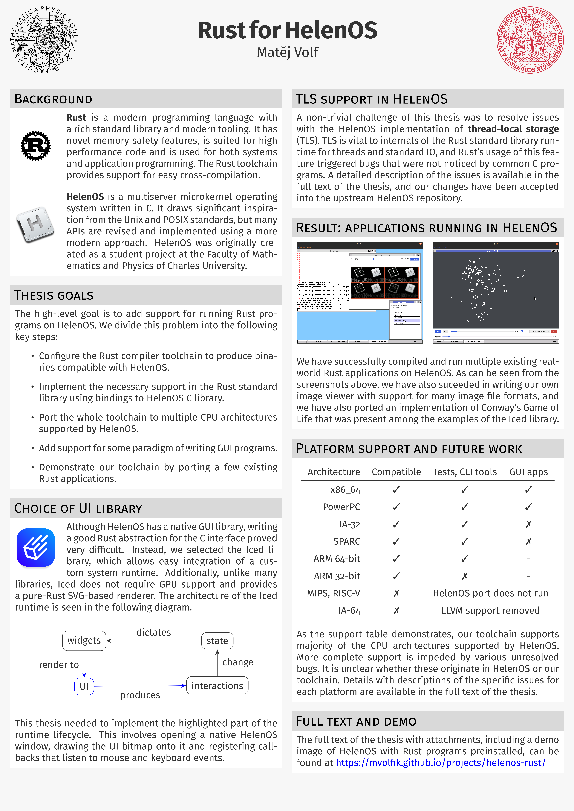

Best overview of my thesis can be seen in the project poster below (also downloadable as a [PDF](/s/b-poster.pdf)).

You can also download a [HelenOS bootable ISO with preinstalled Rust programs](/s/helenos-rust-x86_64.iso). Run it with QEMU like this:

```bash
qemu-system-x86_64 -device e1000,netdev=n1 -netdev \
user,id=n1,hostfwd=tcp::8080-:8080,hostfwd=tcp::8081-:8081 \
-usb -device nec-usb-xhci,id=xhci -device usb-tablet -device \
intel-hda -device hda-duplex -serial stdio -boot d \
-m 2G -enable-kvm -cdrom helenos-rust-x86_64.iso
```

The following Rust applications are installed in the system: `rtest` (a test suite), [`chksum`](https://github.com/chksum-rs/cli), [`resvg`](https://github.com/linebender/resvg), [`imagecli`](https://github.com/theotherphil/imagecli), [`imageviewer-rs`](https://github.com/mvolfik/helenos-iced-apps) and [`life`](https://github.com/mvolfik/helenos-iced-apps).


